# Repository Analysis Report

Repository URL: https://github.com/sindresorhus/awesome#readme

## Summary
Here is a summary of the GitHub README:

**What the project does:**
Logto is an open-source authentication platform designed for every app, aiming to be an alternative to Auth0. It provides a better identity infrastructure for developers, allowing them to supercharge their Mac experience and elevate their app development.

**Key features:**

* Effortless backends with infrastructure from code
* Supports any programming language, cloud provider, or deployment automation tool
* Single Sign-On (SSO) and more features available in minutes instead of months
* Enterprise-ready, allowing developers to start selling to enterprise customers with just a few lines of code

**How to install/use it:**
The README does not provide specific installation instructions, but it mentions that the app is available for macOS and can be used to supercharge the Mac experience.

**Important requirements:**
None mentioned in the README, but it's likely that developers will need to have a basic understanding of programming and app development to use Logto.

Note that the README also includes an "Awesome List" section, which appears to be a curated list of various platforms, programming languages, and technologies.

## Important Files
No standard configuration files detected.

## Technology Stack (Based on File Extensions)
- .md: 7 files
- .svg: 6 files
- .ai: 2 files
- .png: 2 files
- .sketch: 1 files

## Project Structure
The following diagram shows the main structure of the repository:

```mermaid
flowchart TD
    Project["cloned_repo"]
    dir_awesome_md["awesome.md"]
    dir_code_of_conduct_md["code-of-conduct.md"]
    dir_contributing_md["contributing.md"]
    dir_create_list_md["create-list.md"]
    dir_license["license"]
    dir_media["📁 media"]
    dir_media_badge_flat_svg["badge-flat.svg"]
    dir_media_badge_flat2_svg["badge-flat2.svg"]
    dir_media_badge_ai["badge.ai"]
    dir_media_badge_svg["badge.svg"]
    dir_media_logo_ai["logo.ai"]
    dir_media_logo_png["logo.png"]
    dir_media_logo_svg["logo.svg"]
    dir_media_mentioned_badge_flat_svg["mentioned-badge-flat.svg"]
    dir_media_mentioned_badge_sketch["mentioned-badge.sketch"]
    dir_media_mentioned_badge_svg["mentioned-badge.svg"]
    dir_media_readme_md["readme.md"]
    dir_media_social_preview_png["social-preview.png"]
    dir_media --> dir_media_badge_flat_svg
    dir_media --> dir_media_badge_flat2_svg
    dir_media --> dir_media_badge_ai
    dir_media --> dir_media_badge_svg
    dir_media --> dir_media_logo_ai
    dir_media --> dir_media_logo_png
    dir_media --> dir_media_logo_svg
    dir_media --> dir_media_mentioned_badge_flat_svg
    dir_media --> dir_media_mentioned_badge_sketch
    dir_media --> dir_media_mentioned_badge_svg
    dir_media --> dir_media_readme_md
    dir_media --> dir_media_social_preview_png
    dir_pull_request_template_md["pull_request_template.md"]
    dir_readme_md["readme.md"]
    Project --> dir_awesome_md
    Project --> dir_code_of_conduct_md
    Project --> dir_contributing_md
    Project --> dir_create_list_md
    Project --> dir_license
    Project --> dir_media
    Project --> dir_pull_request_template_md
    Project --> dir_readme_md
```

## Getting Started for Contributors

Based on the repository structure, here are some suggestions for new contributors:

1. Explore the important files listed above to understand the project configuration
2. Check for CONTRIBUTING.md or similar files that may contain contribution guidelines
3. Look for tests directories to understand how to test your changes
4. Set up the development environment according to the README instructions
5. Start with small, well-defined issues or improvements
